# Game Design Document (GDD)

# Missão Bios

**Aluno:** Andressa Rodrigues Lopes  
**E-mail:** an.lopes@catolicasc.edu.br  

**Status do Projeto:**  
Pesquisa

**Versão do Documento:** v0.3  
**Última atualização:** 02/06/2026

---

# 1. Visão Geral

## Elevated Pitch

Missão Bios é um jogo educativo em 2D, com visual pixel art e perspectiva top-down, onde o jogador assume o papel de um aprendiz em uma estação científica no planeta fictício Vitta.
Durante a missão, a estação é contaminada por micro-organismos desconhecidos, afetando os cientistas e comprometendo os sistemas da base. O jogador deve investigar o problema e restaurar a estação por meio da exploração e da resolução de desafios baseados em conceitos de ciências do ensino fundamental.
O diferencial do jogo está na aprendizagem baseada na experimentação, inspirada no método científico, incentivando o jogador a observar, testar hipóteses, aprender com erros e construir conhecimento de forma ativa.

---

## Gênero

- **Educativo:** O jogo tem como objetivo principal promover a aprendizagem de conceitos científicos de forma interativa, utilizando situações práticas e contextualizadas dentro da narrativa.
- **Puzzle:** A progressão do jogo ocorre por meio da resolução de desafios que exigem raciocínio lógico, interpretação de informações e tomada de decisão baseada em observação e experimentação.
- **Aventura:** O jogador explora diferentes áreas da estação espacial, interage com personagens e descobre informações que contribuem para o avanço da história e resolução dos problemas.

---

## Público-Alvo

- **Crianças entre 7 e 11 anos:** Faixa etária correspondente ao ensino fundamental inicial, onde há introdução a conceitos básicos de ciências.
- **Estudantes do ensino fundamental:** O jogo pode ser utilizado como ferramenta complementar ao ensino escolar, reforçando conteúdos de forma prática e interativa.
- **Jogadores casuais:** O jogo é projetado para ser acessível, com mecânicas simples e intuitivas, permitindo que qualquer jogador compreenda e jogue sem necessidade de experiência prévia.

---

## Plataformas

- **Web:** A escolha da plataforma web visa facilitar o acesso ao jogo, permitindo sua utilização em diferentes dispositivos com navegador, especialmente em ambientes educacionais como escolas, sem necessidade de instalação.

---

# 2. Acesso ao Projeto

| Item | Link |
|-----|-----|
| Build jogável | Link do Itch.io a ser gerado na fase de produção (Próximo Semestre). |
| Repositório | [GitHub](https://github.com/AndressaLp/missao-bios) |
| Instruções de execução | Execução direta via Navegador Web através do Itch.io. Sem necessidade de instalação. |

---

# 3. Pesquisa e Referências

## Jogos de Referência

### Among Us:
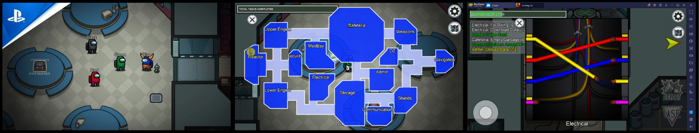

- Descrição:

Among Us é um jogo multiplayer em visão top-down onde jogadores realizam tarefas dentro de uma nave espacial enquanto tentam identificar impostores.

-	Aspectos que inspiraram o projeto:
    -	Perspectiva top-down simples e clara
    -	Interação com objetos do cenário (tarefas)
    -	Interface minimalista e intuitiva
    -	Organização do mapa em salas com funções específicas

### Stardew Valley:
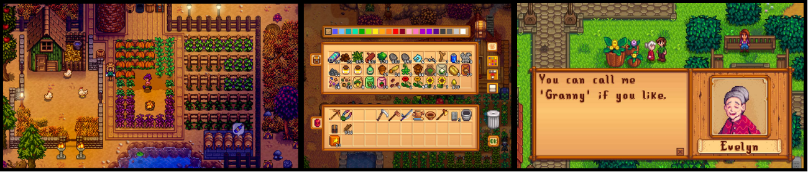

- Descrição:

Stardew Valley é um jogo de simulação e exploração em pixel art, onde o jogador interage com personagens, gerencia recursos e realiza diversas atividades.

- Aspectos que inspiraram o projeto:
    - Estilo visual em pixel art
    - Sistema de interação com NPCs
    - Exploração livre do ambiente
    - Interface simples com inventário acessível

### Undertale:
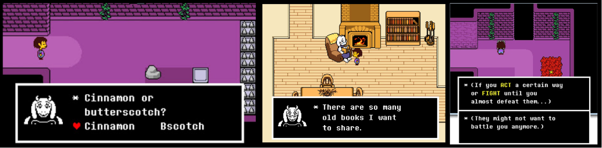

- Descrição:

Undertale é um RPG independente focado em narrativa e interação com personagens, com forte uso de diálogos e escolhas.

- Aspectos que inspiraram o projeto:
    - Sistema de diálogos com personagens (NPCs)
    - Uso de texto para guiar o jogador
    - Conexão entre narrativa e mecânicas
    - Feedback ao jogador durante as interações

---

## Análise das Referências

Os jogos analisados apresentam características importantes que influenciam diretamente o desenvolvimento de Missão Bios.

Todos eles possuem interfaces simples e acessíveis, o que facilita a compreensão do jogador, especialmente importante para o público infantil. Além disso, utilizam interações diretas com o ambiente, permitindo que o jogador aprenda fazendo, em vez de apenas recebendo informações.

Outro ponto em comum é a organização do jogo em espaços bem definidos, como salas ou áreas específicas, o que ajuda na navegação e estruturação dos objetivos, algo que será aplicado na divisão da estação em laboratório, enfermaria e outras salas.

As principais ideias que inspiraram o projeto foram:
- Uso de perspectiva top-down para facilitar a visualização
- Exploração guiada, mas com certa liberdade para o jogador
- Interação com NPCs para ensinar e orientar
- Interface simples e intuitiva, adequada para crianças
- Integração entre narrativa e gameplay, tornando o aprendizado mais natural

Essas referências contribuíram para a construção de uma experiência que combina exploração, narrativa e resolução de problemas, alinhada com a proposta educativa do jogo.

---

# 4. Hipóteses de Design

| Hipótese | Como será testada |
|-----|-----|
| Jogadores aprendem melhor ao experimentar em vez de responder perguntas diretas | Playtests observando se o jogador consegue resolver puzzles sem instruções explícitas |
| Feedback com dicas (em vez de “erro”) reduz frustração | Testar respostas dos jogadores ao errar e analisar se continuam tentando |
| Interface simples facilita o entendimento para crianças | Testes com usuários verificando se conseguem jogar sem ajuda |
| Divisão do jogo em salas (laboratório, enfermaria, etc.) melhora a organização | Observar se o jogador entende facilmente para onde deve ir |
| Pequenas variações nos puzzles aumentam rejogabilidade | Testar múltiplas partidas e verificar se o jogador continua engajado |

## Pilares do jogo

- Aprender Jogando: O jogador aprende conceitos científicos por meio da experimentação e resolução de problemas.
- Simplicidade e Clareza: Interface, controles e objetivos fáceis de entender, especialmente para crianças.
- Exploração Guiada: O jogador tem liberdade para explorar, mas sempre com objetivos claros.
- Feedback Positivo: Erros não punem diretamente, mas ensinam e incentivam novas tentativas.

---

# 5. Gameplay

## Core Loop

Explorar a estação → Interagir com NPCs → Resolver desafios científicos → Receber feedback → Restaurar sistemas → Avançar para o próximo desafio

  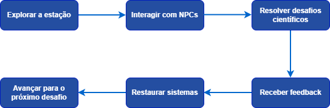

## Loops Secundários

- Conversar com NPC → receber explicação → aplicar no puzzle
- Testar solução → errar → receber dica → tentar novamente
- Coletar item → usar no puzzle → entender função do item

  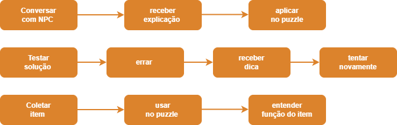

---

## Mecânicas Principais

| Mecânica | Descrição |
|-----|-----|
| Movimento | O jogador se move utilizando teclado (WASD ou setas) em um ambiente 2D top-down |
| Interação | Interage com NPCs e objetos usando tecla ou mouse |
| Diálogo | Sistema de caixas de texto que guiam o jogador |
| Coleta de itens | Coleta e utiliza itens simples no inventário |
| Resolução de puzzles | Identificação, associação e experimentação para resolver desafios |

## Estrutura dos Puzzles

### Puzzle 1: Laboratório de Microrganismos
- Objetivo: Identificar corretamente os microrganismos presentes nas amostras coletadas no planeta Vitta e determinar como eliminá-los.
- Funcionamento: O jogador recebe três amostras contaminadas, que podem ser analisadas em um microscópio interativo.
    - Ao observar cada amostra, são exibidas características do microrganismo, como:
        - Formato
        - Cor
        - Comportamento
        - Ambiente onde foi encontrado
        - Outras propriedades relevantes
    - Além da observação, o jogador pode aplicar diferentes métodos experimentais para analisar reações do microrganismo, como:
        - Aquecimento
        - Exposição à radiação UV
        - Aplicação de substâncias químicas
        - Filtragem
    - Com base nas observações e experimentos, o jogador deve selecionar:
        - Qual é o microrganismo
        - Qual método é eficaz para eliminá-lo
- Erros: Escolhas incorretas geram explicações educativas fornecidas por NPCs
    - Após múltiplos erros, dicas são apresentadas
    - Ao rejogar, novas combinações de microrganismos podem ser geradas
- Aprendizado:
    - Observação científica
    - Comparação de características
    - Interpretação de dados
    - Introdução ao método científico

### Puzzle 2: Enfermaria
- Objetivo: Identificar a causa da contaminação dos pacientes e produzir a cura adequada.
- Funcionamento:
    - Cada paciente apresenta informações como:
        - Sintomas visuais
        - Temperatura
        - Frequência cardíaca
        - Descrição do estado
    - O jogador deve relacionar essas informações com os dados obtidos no laboratório.
    - Após isso, o jogador entra em um sistema de criação de cura (ex: bancada ou outra sala), onde pode:
        - Selecionar ingredientes
        - Misturar substâncias
        - Produzir uma solução
    - Cada substância possui:
        - Descrição
        - Efeito
        - Utilidade
    - Após produzir a cura, o jogador deve aplicá-la no paciente correto.
- Erros: 
    - Misturas incorretas geram reações visuais e feedback educativo
    - NPCs explicam o motivo do erro
    - Aplicação incorreta é interrompida com explicação
- Aprendizado:
    - Associação lógica
    - Interpretação de sintomas
    - Relação entre causa e efeito
    - Noções básicas de tratamento científico

### Puzzle 3: Purificação da Água
- Objetivo: Tornar potáveis as amostras de água contaminadas.
- Funcionamento:
    - Cada recipiente de água apresenta:
        - Aparência visual diferente
        - Descrição
        - Nível de contaminação
    - O jogador deve escolher o método mais adequado para purificação, como:
        - Filtração
        - Fervura
        - Destilação
        - Decantação
    - O processo é apresentado de forma visual, por exemplo:
        - Água passando por filtros
        - Ebulição
        - Separação de resíduos
    - Após o processo, um scanner indica se a água está própria para consumo.
- Erros:
    - Métodos inadequados mantêm a contaminação
    - Feedback educativo explica o erro
- Aprendizado:
    - Tratamento de água
    - Propriedades físicas
    - Processos científicos reais

## Camera

- Tipo: Top-down (visão de cima)
- Comportamento: Fixa acompanhando o jogador
- Objetivo: Facilitar visualização e navegação

---

## Sistemas

**Vitória**

O jogador vence ao:
- Resolver os 3 desafios principais
- Restaurar completamente os sistemas da estação
- Finalizar a missão com sucesso

**Derrota**

Não há derrota tradicional.

O jogador:
- Erra → recebe explicação
- Após várias tentativas → puzzle reinicia
- A barra de progresso diminui

**Progressão**

A progressão é baseada em:
- Conclusão de desafios
- Restauração gradual da estação (barra de progresso)
- Avanço entre salas (laboratório → enfermaria → água)

Cada puzzle concluído:
- Aumenta a barra de progresso
- Desbloqueia o próximo desafio
- Avança na história

---

# 6. Escopo do Projeto

## O jogo inclui

- 1 mapa principal (estação espacial dividida em salas)
- 3 desafios principais (laboratório, enfermaria e purificação da água)
- 3 NPCs principais com diálogos e orientações
- Sistema de movimentação do personagem (top-down)
- Sistema de interação com objetos e NPCs
- Sistema de diálogo com feedback educativo
- Sistema de objetivos (missões)
- Sistema de inventário simples (até 3 itens)
- Sistema de progressão por barra (restauração da estação)
- Variação simples nos puzzles para rejogabilidade
- Cutscene inicial e final (simples, com imagens/texto)

## O jogo não inclui

- Multiplayer
- Sistema de combate
- Sistema complexo de crafting
- Mundo aberto amplo
- IA avançada
- Sistema de níveis/upgrades do personagem
- Geração procedural complexa
- Backend online (ranking/login online)

---

# 7. Prototipagem

Planejamento dos protótipos que serão desenvolvidos:

| Protótipo | Objetivo | Resultado esperado |
|-----|-----|-----|
| Movimento do personagem | Validar controles (WASD/setas) | Jogador se move com facilidade |
| Interação com objetos | Testar interação com tecla/mouse | Interações claras e intuitivas |
| Sistema de diálogo | Validar leitura e avanço de texto | Jogador entende instruções |
| Puzzle simples | Testar lógica de tentativa e erro | Jogador aprende com feedback |
| Sistema de feedback | Testar dicas após erro | Redução de frustração |

---

# 8. Interface (UI/UX)

## HUD

- Nome do jogador
- Objetivos atuais (missões)
- Barra de inventário (até 3 itens)
- Botão/menu de pausa
- Botão de ajuda (“como jogar”)

  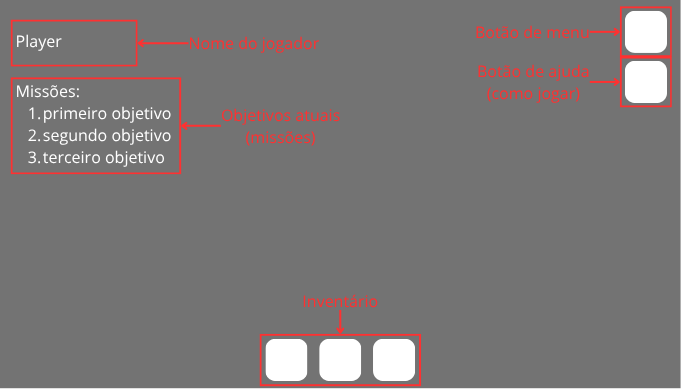
  
Protótipo de baixa fidelidade da interface de usuário (HUD).

---

## Menus

- menu principal
    - Novo jogo
    - Continuar jogo
    - Selecionar jogador
    - Como jogar
    - Opção de som (ligar/desligar)

  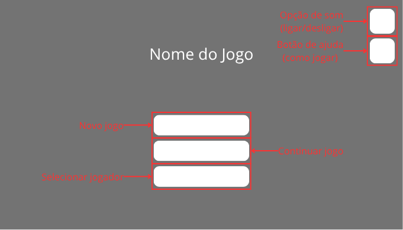
  
Protótipo de baixa fidelidade da interface de usuário (menu principal).

- Menu de pausa
    - Continuar
    - Voltar ao menu
    - Como jogar

  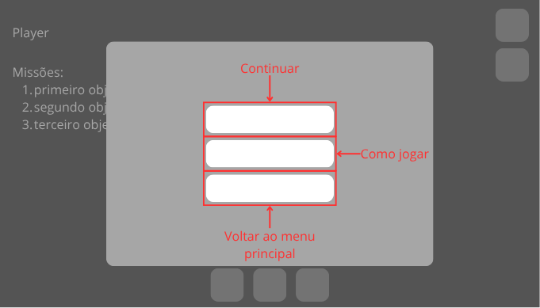
  
Protótipo de baixa fidelidade da interface de usuário (menu de pausa).

## Flow de menus

  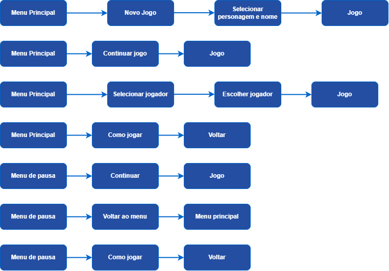

## Controles

  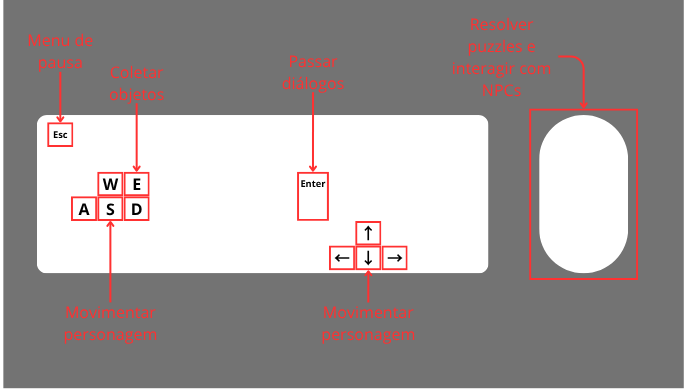
  
Protótipo de baixa fidelidade dos controles do jogo.

## Mockups

Foram desenvolvidos alguns mockups para representar visualmente as principais telas e a organização das informações do jogo. As demais salas e desafios seguirão essa mesma lógica visual, adaptando os elementos de acordo com o contexto de cada tema.

- Menu principal

  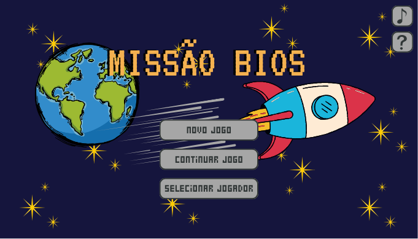
  
Protótipo conceitual da tela inicial do jogo. O layout, posicionamento dos elementos e artes podem sofrer alterações durante o desenvolvimento, sendo utilizados apenas para representar a proposta visual inicial.

- Puzzle 1: Laboratório de microrganismos

  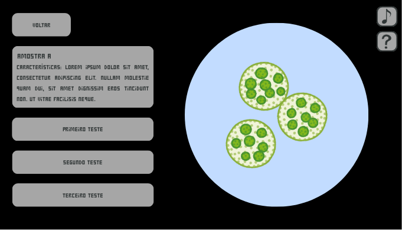
  
Protótipo conceitual de um dos desafios científicos do jogo. Os elementos apresentados representam a ideia geral da interface do puzzle e poderão ser modificados ou refinados durante a implementação.

- Painel da estação espacial

  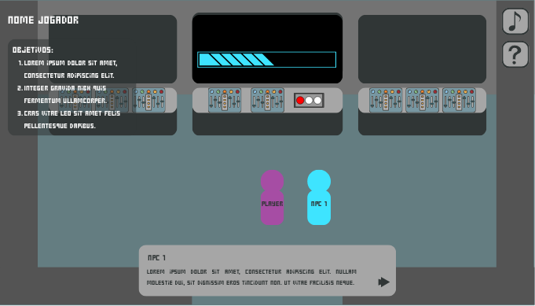
  
Protótipo conceitual da interface principal de gameplay, demonstrando a interação entre personagem, NPCs, objetivos e sistemas da estação. O layout final poderá sofrer alterações conforme os testes e o desenvolvimento do projeto.

---

# 9. Direção Visual

## Direção de Arte

O jogo Missão Bios adotará um estilo visual em pixel art 2D com perspectiva top-down, inspirado em jogos clássicos, porém com cores vibrantes e elementos modernos para torná-lo atrativo ao público infantil.

A direção de arte busca equilibrar simplicidade visual (para facilitar o desenvolvimento e a leitura do jogo) com expressividade, utilizando animações simples e feedbacks visuais claros para reforçar o aprendizado.

Principais características visuais:
- Pixel art estilizado com baixo a médio nível de detalhe
- Perspectiva top-down (visão de cima)
- Cores vivas e contrastantes, facilitando identificação de elementos
- Personagens simples
- Ambientes organizados por salas (laboratório, enfermaria, etc.)
- Feedback visual educativo (erros geram reações visuais)

O estilo visual também contribui para o aprendizado, permitindo que o jogador associe cores, formas e animações aos conceitos científicos apresentados.

---

## Referências Visuais

- Estilo Pixel Art Top-Down

  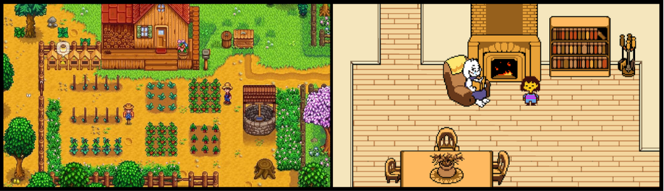
  
Referência do estilo pixel art top-down dos jogos Stardew Valley e Undertale

- Ambientes Científicos (Laboratório / Enfermaria)

  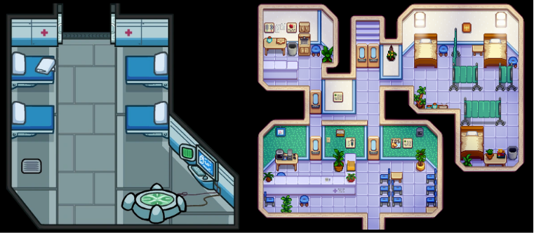
  
Referência de ambiente científico dos jogos Among Us e Stardew Valley

- Tema Espacial

  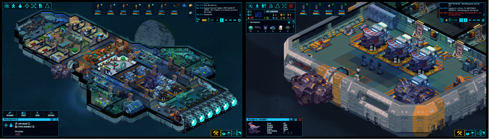
  
Referência do tema espacial do jogo Space Haven

---

# 10. Áudio

O áudio de Missão Bios terá como objetivo reforçar a ambientação espacial, auxiliar na imersão do jogador e fornecer feedbacks claros durante os desafios.

Os sons serão utilizados de forma simples e funcional, priorizando clareza e conforto para o público infantil, evitando excesso de estímulos sonoros.

| Tipo | Onde será usado | Loop | Descrição |
|-----|-----|-----|-----|
| Música ambiente espacial | Menu inicial | Sim | Música calma com tema espacial e científico |
| Música da estação | Gameplay principal | Sim | Trilha leve e futurista durante exploração |
| Música de tensão | Alertas da estação | Sim | Música mais intensa quando a barra da estação estiver baixa |
| Som de interação | Conversar com NPCs e objetos | Não | Pequeno efeito sonoro ao interagir |
| Som de coleta | Coletar itens | Não | Feedback rápido e satisfatório |
| Som de erro | Respostas incorretas | Não | Som curto e leve, sem punição exagerada |
| Som de acerto | Resolver puzzles | Não | Feedback positivo ao completar ações |
| Som de máquina/laboratório | Laboratório e análise | Sim | Sons ambientes tecnológicos e científicos |
| Som de água | Puzzle da purificação | Sim | Sons suaves relacionados à água e filtragem |
| Som de alerta | Sistemas críticos | Não | Avisos sonoros quando a estação estiver instável |

## Estilo Sonoro

O estilo sonoro do jogo será inspirado em:
- Ficção científica leve
- Sons eletrônicos suaves
- Ambientes espaciais futuristas
- Feedbacks sonoros simples e educativos

As músicas terão ritmo calmo para evitar distração excessiva, permitindo que o jogador foque nos puzzles e no aprendizado.

## Referências Sonoras

Possíveis inspirações para o estilo de áudio:
- Trilhas espaciais suaves semelhantes a jogos de exploração
- Sons eletrônicos simples inspirados em jogos indie pixel art
- Feedbacks sonoros curtos e claros, semelhantes a jogos educativos modernos

---

# 11. Animação

As animações de Missão Bios terão foco em clareza visual, feedback ao jogador e expressividade dos ambientes e personagens. Como o projeto será desenvolvido em pixel art 2D, as animações serão simples, mas suficientes para tornar a experiência mais dinâmica e divertida.

| Animação | Onde será usada | Loop | Descrição |
|-----|-----|-----|-----|
| Idle do personagem | Gameplay geral | Sim | Personagem parado com pequena movimentação |
| Movimento do personagem | Exploração da estação | Sim | Caminhada em 4 direções |
| Interação com objetos | Coleta e uso de itens | Não | Pequena animação ao interagir |
| NPC falando | Diálogos | Sim | Movimento simples durante conversa |
| Porta abrindo | Transição entre salas | Não | Animação curta ao entrar em salas |
| Painel da estação | Painel de controle | Sim | Luzes e indicadores piscando |
| Barra de progresso | Sistema da estação | Sim | Barra aumentando ou diminuindo |
| Microscópio analisando | Puzzle do laboratório | Sim | Luzes e movimento de análise |
| Microrganismos | Puzzle científico | Sim | Movimento simples dos organismos |
| Mistura de elementos | Puzzle da cura | Não | Reação visual ao criar substâncias |
| Água sendo filtrada | Puzzle da água | Sim | Movimento de líquidos e filtros |
| Erro no puzzle | Feedback de erro | Não | Pequena explosão, fumaça ou efeito visual |
| Acerto no puzzle | Feedback positivo | Não | Luzes, partículas ou efeito visual |
| Alerta da estação | Sistema crítico | Sim | Luz vermelha piscando |
| Cientistas voltando ao trabalho | Finalização de puzzles | Não | NPCs andando pela estação |

## Feedback Visual (Game Feel)

O jogo utilizará animações simples para reforçar ações importantes:
- partículas leves ao acertar puzzles 
- pequenas explosões em erros 
- luzes piscando durante alertas 
- mudanças visuais no painel da estação 
- reações visuais dos NPCs 

Esses elementos ajudam a tornar o aprendizado mais divertido e menos punitivo.

---

# 12. Arquitetura de Software

O projeto será organizado utilizando separação de responsabilidades, facilitando manutenção e expansão do código. A arquitetura será baseada em sistemas independentes controlados por um gerenciador principal do jogo.

## Estrutura Geral

- GameManager: Responsável pelo controle geral do jogo, progresso da estação, mudança de puzzles e fluxo principal.
- PuzzleManager: Gerencia os estados dos puzzles, verificando erros, acertos e reinícios.
- DialogueManager: Controla diálogos dos NPCs, textos e feedbacks educativos.
- SaveManager: Responsável pelo salvamento local dos perfis dos jogadores.
- UIManager: Gerencia HUD, menus, barra de progresso e interface geral.
- AudioManager: Controla músicas, efeitos sonoros e alertas da estação.
- SceneManager: Responsável pelas transições entre salas da estação.

## Organização dos Scripts

Os scripts serão separados por responsabilidade:

| Categoria | Função |
|-----|-----|
| Player | Movimento e interação |
| NPC | Diálogos e comportamento |
| Puzzle | Regras e lógica dos desafios |
| UI | Interface e HUD |
| Managers | Controle geral dos sistemas |
| Áudio | Sons e músicas |
| Save | Salvamento local |

---

## Tecnologias Utilizadas

| Categoria | Ferramenta |
|-----|-----|
| Engine | Godot |
| Linguagem | C# |
| Versionamento | Git + GitHub |
| Documentação | Markdown + GitHub |
| Áudio e efeitos sonoros | itch.io / Pixabay |
| Pixel Art | Piskel |

## Controle de Versão

O projeto utilizará GitHub para:
- armazenamento do código
- versionamento
- documentação
- registro de progresso
- colaboração e revisões

---

# 13. Testes e Playtests

## Planejamento de Playtests

Como o jogo ainda está em fase de documentação e pré-produção, os playtests serão realizados durante o desenvolvimento do protótipo no próximo semestre.

Os testes terão como objetivo validar:
- clareza dos objetivos
- facilidade dos controles
- entendimento dos puzzles
- nível de dificuldade
- interesse do público infantil
- eficiência da aprendizagem baseada em experimentação

## Playtests Planejados

| Data | Participantes | Objetivo |
|-----|-----|-----|
| A definir | 3–5 pessoas | Testar movimentação e interação |
| A definir | 3–5 pessoas | Testar clareza dos puzzles |
| A definir | 3–5 pessoas | Validar dificuldade e feedbacks |
| A definir | Público-alvo infantil | Avaliar aprendizado e diversão |

---

## Possíveis Problemas Esperados

| Problema | Possível solução |
|-----|-----|
| Jogador não entende objetivo | Melhorar objetivos na HUD |
| Puzzle confuso | Adicionar mais feedback visual |
| Dificuldade elevada | Ajustar quantidade de erros permitidos |
| Jogador perdido no mapa | Melhorar sinalização das salas |
| Criança não entende mecânica | Adicionar explicações mais visuais |

## Melhorias Implementadas

Esta seção será preenchida após os playtests realizados durante o desenvolvimento do projeto.

Exemplo de estrutura:

| Problema identificado | Solução aplicada |
|-----|-----|
| Jogadores não encontravam o laboratório | Adicionado indicador visual |
| Objetivos pouco claros | HUD reformulada |
| Puzzle muito difícil | Dicas adicionais adicionadas |

---

# 14. Cronograma

| Etapa | Período |
|-----|-----|
| Definição da ideia do projeto | Concluído |
| Pesquisa e referências | Concluído |
| Escrita do GDD | Em andamento |
| Validação da ideia com formulário | Em andamento |
| Organização da documentação | Em andamento |
| Desenvolvimento do protótipo inicial | Próximo semestre |
| Implementação do sistema de movimentação | Próximo semestre |
| Implementação dos puzzles | Próximo semestre |
| Implementação da interface | Próximo semestre |
| Implementação de áudio e animações | Próximo semestre |
| Testes e playtests | Próximo semestre |
| Ajustes finais e polimento | Próximo semestre |
| Entrega final do projeto | Próximo semestre |

## Milestones Principais

| Milestone | Objetivo |
|-----|-----|
| GDD completo | Finalizar documentação do jogo |
| Protótipo jogável | Movimentação + interação básica |
| Primeiro puzzle funcional | Sistema de puzzles validado |
| Gameplay completa | Todos os desafios implementados |
| Versão para testes | Playtests com usuários |
| Versão final | Projeto concluído |

## Observação

O cronograma poderá sofrer ajustes conforme o andamento do desenvolvimento e os resultados obtidos durante os testes do projeto.

---

# 15. Riscos do Projeto

| Risco | Impacto | Mitigação |
|-----|-----|-----|
| Escopo muito grande para desenvolvimento individual | Atraso no projeto | Reduzir quantidade de mecânicas e manter foco nos puzzles principais |
| Puzzles ficarem confusos para crianças | Dificuldade de aprendizado | Realizar playtests e simplificar explicações |
| Interface pouco intuitiva | Jogador não entender objetivos | Melhorar HUD e adicionar feedback visual |
| Falta de experiência com a engine | Desenvolvimento mais lento | Utilizar sistemas simples e estudar durante o desenvolvimento |
| Tempo insuficiente para implementar todas as ideias | Funcionalidades incompletas | Priorizar funcionalidades essenciais |
| Problemas com organização do código | Dificuldade de manutenção | Separar scripts por responsabilidade |
| Assets e animações demorarem muito | Atraso visual do projeto | Utilizar pixel art simples e reutilização de assets |
| Performance baixa no navegador | Experiência ruim | Reduzir efeitos visuais e otimizar cenas |
| Sistema de puzzles ficar repetitivo | Perda de interesse do jogador | Variar situações e elementos dos desafios |
| Feedbacks educativos não serem claros | Jogador não aprender corretamente | Ajustar diálogos e explicações dos NPCs |

---

# 16. Limitações Conhecidas

As funcionalidades abaixo foram consideradas para o projeto, porém podem não ser implementadas devido ao escopo e ao tempo disponível de desenvolvimento:
- Multiplayer online
- Salvamento em nuvem
- Sistema de contas online/login
- Sistema avançado de geração procedural
- Narração completa dos diálogos
- Dublagem dos personagens
- Grande quantidade de fases
- Muitos tipos diferentes de puzzles
- Sistema complexo de crafting
- Inteligência artificial avançada para NPCs
- Tradução para múltiplos idiomas
- Sistema mobile
- Backend completo para análise de desempenho
- Ranking online de jogadores
- Expansão da exploração fora da estação espacial

---

# 17. Decisões Importantes

| Data | Decisão | Motivo |
|-----|-----|-----|
| Março | Definição do tema espacial científico | Tornar o jogo mais atrativo para crianças |
| Março | Alteração da história para contaminação biológica | Melhor conexão entre os puzzles |
| Março | Remoção de exploração externa do planeta | Reduzir escopo do projeto |
| Março | Definição do estilo pixel art top-down | Facilitar desenvolvimento e leitura visual |
| Abril | Escolha da plataforma Web | Facilitar acesso em ambiente escolar |
| Abril | Uso de aprendizagem baseada no método científico | Tornar o ensino mais interativo |
| Abril | Adição de feedbacks educativos nos erros | Evitar frustração do jogador |
| Abril | Definição de puzzles variáveis | Incentivar compreensão ao invés de memorização |
| Abril | Limitação do inventário em 3 itens | Simplificar interface |
| Abril | Escolha do nome “Missão Bios” | Relacionar ciência, vida e exploração espacial |

---

# 18. Créditos

## Recursos Externos Planejados

| Recurso | Fonte | Licença |
|-----|-----|-----|
| Fonte de texto | Google Fonts | Gratuito |
| Música e efeitos sonoros | itch.io / Pixabay | Gratuito |
| Engine do jogo | Godot Engine | Open Source |

## Observação

Os assets finais ainda poderão ser alterados durante o desenvolvimento do projeto. Todos os recursos externos utilizados serão devidamente creditados conforme suas respectivas licenças.

---

# 19. Reflexão Final

O desenvolvimento inicial do projeto permitiu compreender melhor os desafios envolvidos na criação de um jogo educativo que seja ao mesmo tempo divertido, acessível e pedagogicamente relevante. Um dos principais desafios foi encontrar equilíbrio entre aprendizagem e entretenimento, evitando que o jogo se tornasse apenas uma atividade escolar com aparência de jogo.

Outro aprendizado importante foi a necessidade de controlar o escopo do projeto. Durante o planejamento surgiram diversas ideias e funcionalidades, porém foi necessário simplificar várias delas para manter o desenvolvimento viável dentro do tempo disponível e da complexidade adequada para um projeto individual.

Além dos aspectos técnicos relacionados à documentação, organização e arquitetura do projeto, também houve aprendizado sobre game design, experiência do usuário e formas de utilizar o método científico como ferramenta de aprendizagem ativa. Em versões futuras, seria interessante expandir o jogo com novos puzzles, mais áreas exploráveis e sistemas adicionais de progressão.

---

# 20. Referências

AMONG Us Wiki. MedBay. Fandom, [s.d.]. Disponível em: https://among-us.fandom.com/wiki/MedBay. Acesso em: 24 maio 2026.

BARONE, Adam. Among Us Task Guide. BlueStacks, 2020. Disponível em: https://cdn-www.bluestacks.com/bs-images/Among-Us-Task-Guide_EN_6.jpg. Acesso em: 24 maio 2026.

BUGBYTE. Space Haven. Redmond: Steam, 2020. Disponível em: https://store.steampowered.com/app/979110/Space_Haven/?l=portuguese. Acesso em: 24 maio 2026.

BUGBYTE. Space Haven Spaceship Interior Layout. Game Screenshot. Steam Shared Assets, 2020. Disponível em: https://shared.akamai.steamstatic.com/store_item_assets/steam/apps/979110/aad11504605a39c86eef07e3006070e171bc5d52/ss_aad11504605a39c86eef07e3006070e171bc5d52.1920x1080.jpg?t=1778684449. Acesso em: 24 maio 2026.

CONCERNEDAPE. Clínica do Harvey. Stardew Valley Wiki, [s.d.]. Disponível em: https://pt.stardewvalleywiki.com/Cl%C3%A5nica_do_Harvey. Acesso em: 24 maio 2026.

CONCERNEDAPE. Stardew Valley Nintendo Switch Edition. Amazon Brasil, 2020. Disponível em: https://www.amazon.com.br/Fangamer-5060760880859-Stardew-Valley-Nintendo/dp/B08F8KRRGL. Acesso em: 24 maio 2026.

FANGAMER. Undertale Collector's Edition. PlayStation Store, 2017. Disponível em: https://store.playstation.com/tr-tr/product/EP3746-CUSA09415_00-CB00000000000084. Acesso em: 24 maio 2026.

FOX, Toby. Undertale Part 1: The Ruins. Planned All Along, 2018. Disponível em: http://plannedallalong.blogspot.com/2018/07/undertale-part-1.html. Acesso em: 24 maio 2026.

FROGGIT Dialogue Scene. Undertale Community Analysis. Reddit, 2015. Disponível em: https://www.reddit.com/r/Undertale/comments/3tnh6n/this_froggit_gives_the_worst_advice/. Acesso em: 24 maio 2026.

INNERSLOTH. Among Us Cafeteria Map layout. Game Screenshot. IGN Mediawiki, 2020. Disponível em: https://oyster.ignimgs.com/mediawiki/apis.ign.com/among-us/9/95/Screenshot_%28496%29.png?width=1280. Acesso em: 24 maio 2026.

INNERSLOTH. Among Us Skeld Map Promotional Art. Innersloth, 2018. Disponível em: https://i.ytimg.com/vi/71bRUDSUTZE/maxresdefault.jpg. Acesso em: 24 maio 2026.

JONES, Gary. Stardew Valley Layout Mockup. Stardew Valley Forums, 2024. Disponível em: https://forums.stardewvalley.net/attachments/1713490612057-png.22166/. Acesso em: 24 maio 2026.

PERRY, Valentine. Stardew Valley Friendship Guide: Evelyn. Game Rant, 2021. Disponível em: https://gamerant.com/stardew-valley-friendship-guide-evelyn/. Acesso em: 24 maio 2026.

PRESCOTT, Shaun. Undertale's Steam Review Section analysis. PC Gamer, 2015. Disponível em: https://www.pcgamer.com/undertales-steam-review-section-is-pretty-funny/. Acesso em: 24 maio 2026.

SONY Interactive Entertainment. Undertale Gameplay Screenshot. PlayStation Network Assets, 2017. Disponível em: https://image.api.playstation.com/cdn/UP2456/CUSA06840_00/FREE_CONTENTWd3ANCBDRGjycBH01xGL/PREVIEW_SCREENSHOT3_130501.jpg. Acesso em: 24 maio 2026.

